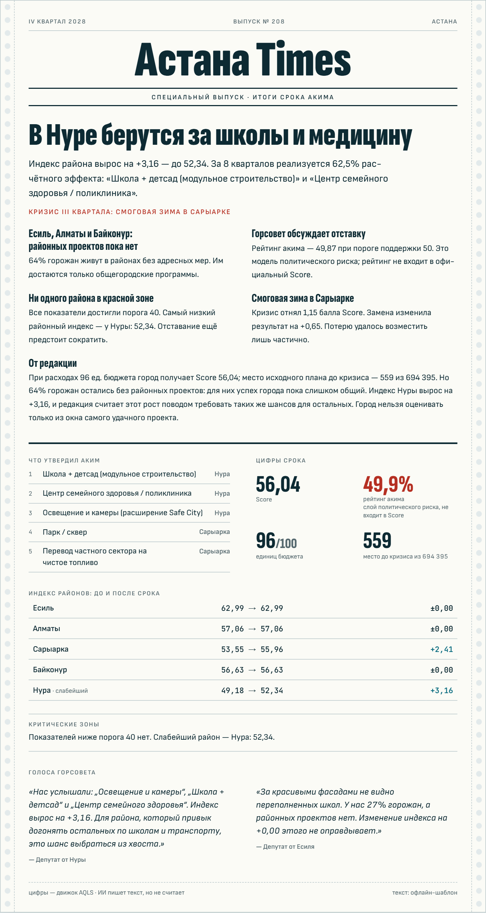
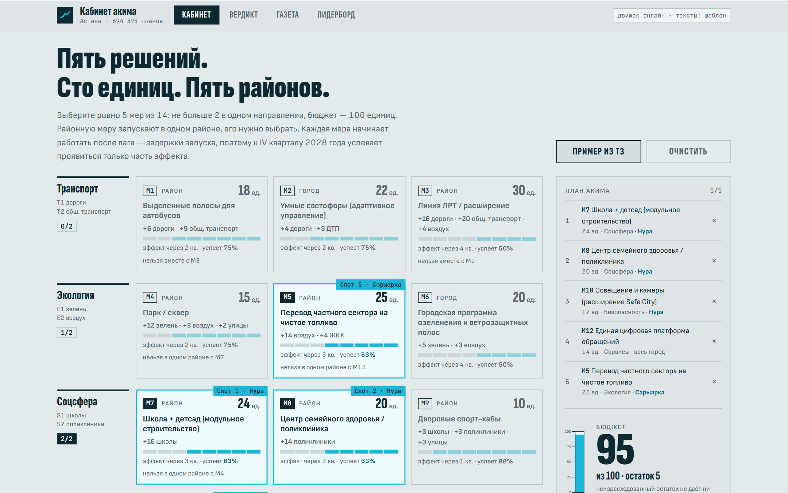
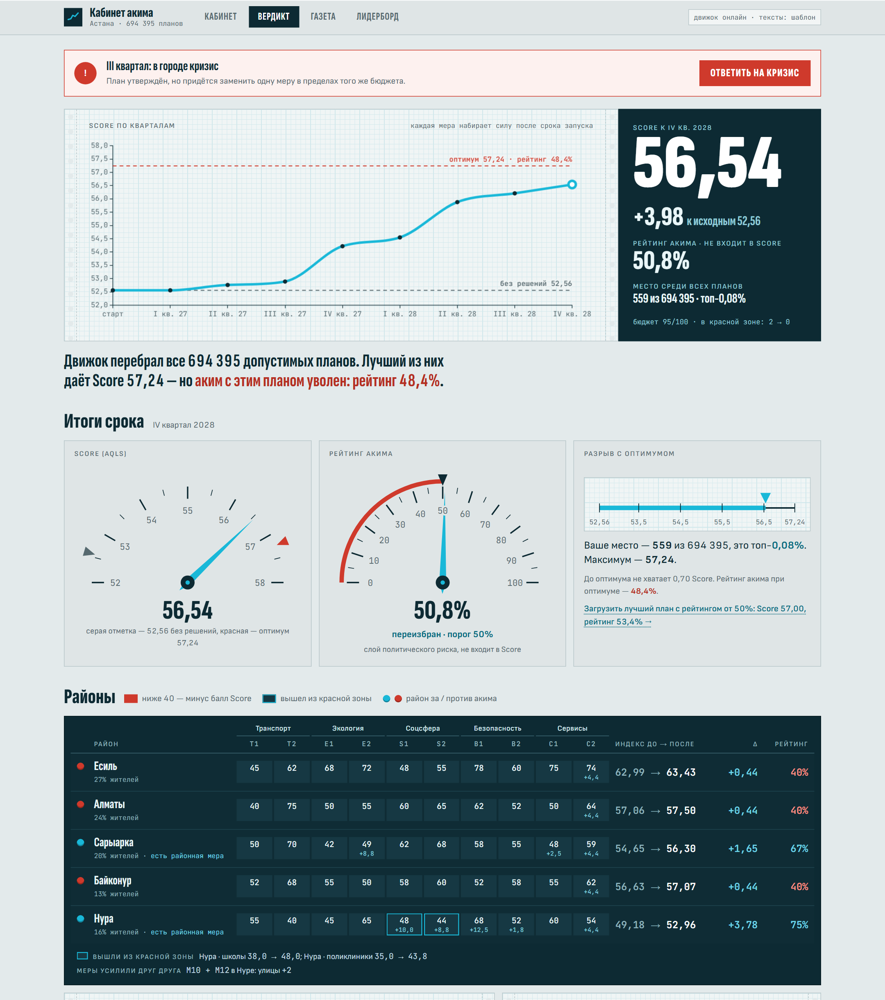
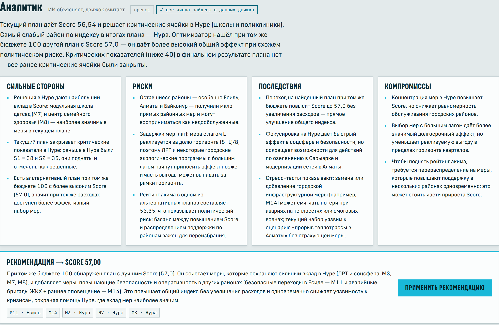
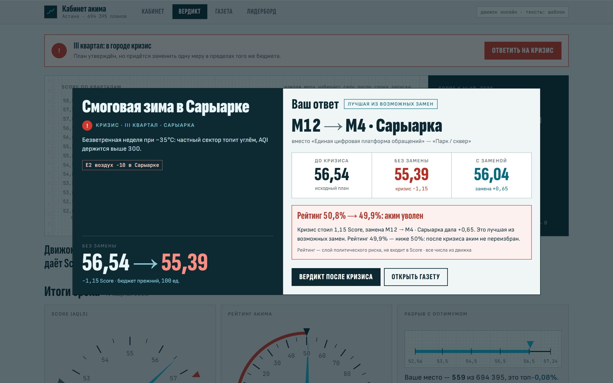
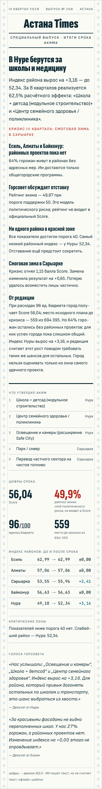
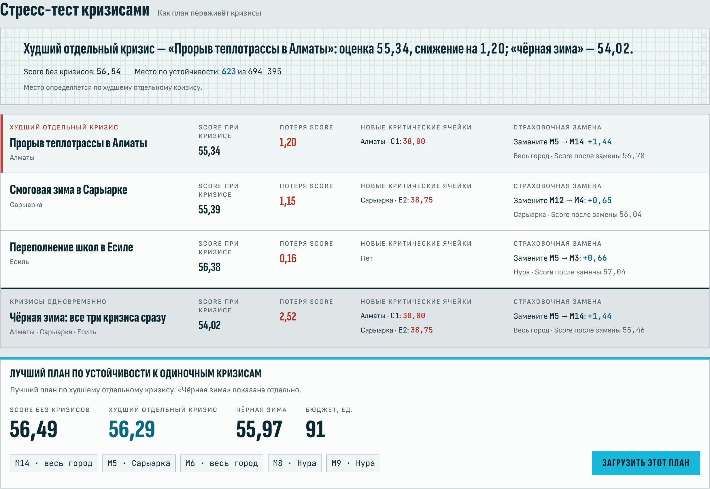
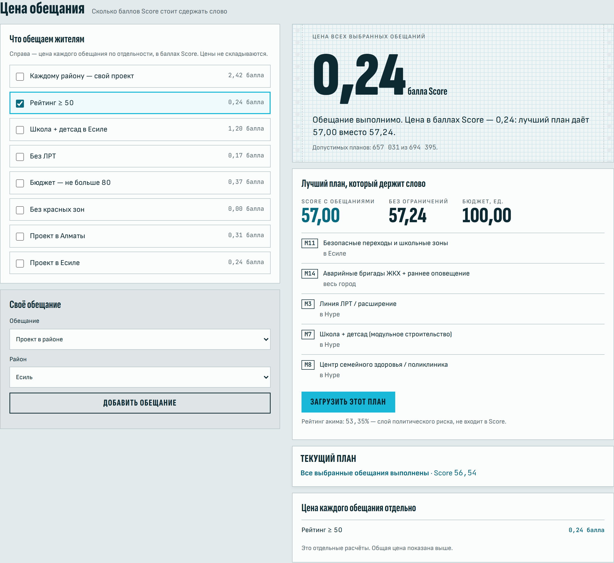
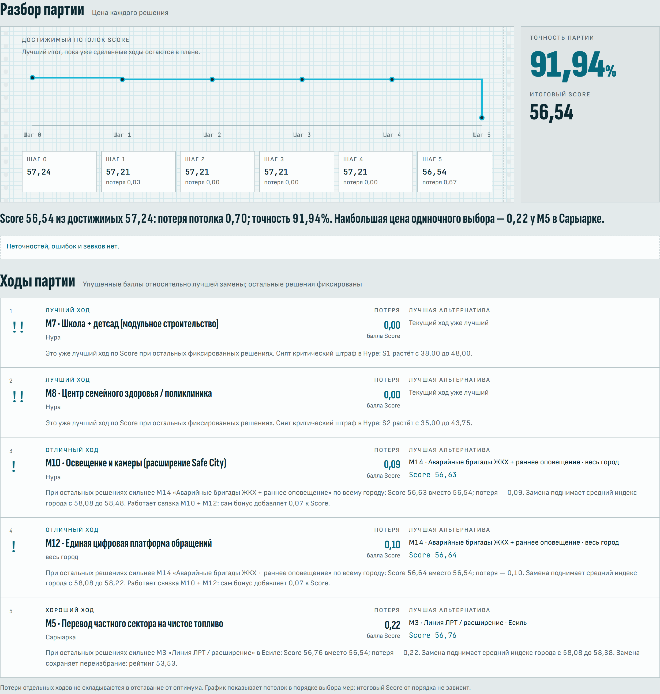

# «Кабинет акима» — AI-симулятор управления городом

**HackAlem AI · кейс «Аким на 5 часов» · команда Locked in Bois**

«Кабинет акима» — симулятор распределения городского бюджета между пятью направлениями и пятью районами Астаны. Детерминированный движок рассчитывает Astana Quality of Life Score по формуле кейса и сравнивает план пользователя со всеми **694 395** допустимыми планами. ИИ-аналитик объясняет результат, используя только числа, полученные от движка. Сценарий дополняют кризисное событие в III квартале и оценка политических последствий решений.



Интерфейс — светлый рабочий стол: графики на миллиметровке, стрелочные шкалы Score и рейтинга, бирюзовые отметки решений и красные сигналы риска. Кабинет, вердикт, кризис и газета адаптированы для телефона; газета оформлена как бумажная первая полоса.

> **Главная находка.** Математически лучший план (Score **57.24**) отдаёт все районные меры Нуре: это 16% жителей. Остальные 84% получают только общегородские программы. Модель политического риска оценивает рейтинг акима при таком плане в **48.41 из 100**, что ниже порога переизбрания 50. Лучший план с рейтингом не ниже порога даёт **57.00** при рейтинге **53.35**. Разница между оптимумом формулы и лучшим политически устойчивым планом составляет 0.24 балла. Приложение показывает пользователю этот компромисс. Рейтинг — наша условная модель риска, не входит в Score.

**Для кого:** аким и его команда, городской аналитик, участник симулятора. **Какую проблему решает:** при ограниченном бюджете показывает, как распределение денег между транспортом, экологией, соцсферой, безопасностью и сервисами меняет качество жизни в каждом районе и кто при этом остаётся без внимания.

## Установка и запуск

Нужен Python 3.10+. Ключ API не нужен: расчёты и шаблонный анализ работают локально; оформлению, шрифтам и графикам нужен интернет (CDN).

```bash
git clone https://github.com/BAITC-Hacks/hack-f09f40c4-locked-in-bois && cd hack-f09f40c4-locked-in-bois
pip install -r requirements.txt
uvicorn api.main:app
```

Откройте **http://localhost:8000**. Документация API (Swagger): **http://localhost:8000/docs**.

Для проверки интерфейса на сохранённых ответах откройте **http://localhost:8000/?mock=1**. Этот режим воспроизводит фикстуры `web/mock/` для примера из условия; произвольные планы проверяйте с работающим API. Офлайн-режим ИИ не требует ключей, но оформление и графики загружают Tailwind, Chart.js и шрифты с CDN.

<details><summary>Через виртуальное окружение (рекомендуется)</summary>

```bash
python -m venv .venv
source .venv/bin/activate        # Windows: .venv\Scripts\activate
pip install -r requirements.txt
uvicorn api.main:app
```
</details>

**Режимы ИИ** (`.env`, см. `.env.example`):

| `LLM_PROVIDER` | Что нужно | Что происходит |
|---|---|---|
| `offline` (по умолчанию) | ничего | Анализ, Совет районов и газета собираются из шаблонов по выходу движка. Все экраны работают. |
| `openai` | `OPENAI_API_KEYS` | Агент с инструментами (tool calling), модель `OPENAI_MODEL` (по умолчанию `gpt-5-mini`). |
| `nvidia` | `NVIDIA_API_KEYS` | То же через OpenAI-совместимый NVIDIA NIM (`NVIDIA_MODEL`). |
| `openai,nvidia` | оба | Цепочка резервов: сначала все ключи OpenAI, потом NVIDIA. |

**Цепочка резервов.** В `*_API_KEYS` можно указать несколько ключей через запятую. Они пробуются по очереди в одном общем лимите времени (`LLM_TIMEOUT`). Ключ, который вернул 401/403/404/410, до перезапуска больше не используется. Если не сработал ни один ключ, провайдер не отвечает или ИИ выдумал число, система сама переходит на офлайн-шаблон. Приложение не падает. `provider` — сработавший провайдер; `fallback_chain` перечисляет предыдущие отказы; при полном отказе причины — в `fallback_reason`. Сами ключи не попадают ни в ответы, ни в логи.

> **Ключи никогда не коммитятся.** `.env` в `.gitignore`. Шаблон без секретов — `.env.example`. Тесты принудительно убирают ключи из окружения и работают офлайн, без сети.

---

## Что реализовано

**Обязательные требования кейса**
- Единый бюджет 100 и одни исходные данные для всех (`data/dataset.json`, отдаются через `GET /api/dataset`).
- Ровно 5 решений из мер в 5 направлениях: транспорт, экология, соцсфера, безопасность, сервисы; выбирать меру в каждом направлении не обязательно.
- Автоматический контроль бюджета и всех 8 правил. Валидатор называет причину отказа, а превысить бюджет нельзя ни в интерфейсе, ни через API (HTTP 422).
- Итоговый **Astana Quality of Life Score** по формуле организаторов, проверенный на эталонных числах.
- ИИ-анализ решений: сильные стороны, риски, последствия, компромиссы, рекомендация.

**Дополнительно (все пять опциональных пунктов кейса)**
- Сравнение команд: лидерборд с серверным пересчётом Score.
- Визуализация изменений по районам: таблица «до → после», график по 8 кварталам, вклад каждой меры, Парето-график.
- ИИ-рекомендации по улучшению: лучший план в том же бюджете и лучший план с рейтингом ≥ 50 в модели.
- Неожиданные городские события: кризис в III квартале с обязательной заменой одной меры в том же бюджете.
- Автогенерация короткой презентации: одностраничник команды в Markdown (`/api/brief`).

**Сверх кейса**
- Полный перебор всех 694 395 допустимых планов: место плана, процентиль, потолок 57.24.
- Слой политического риска «рейтинг акима» (не входит в Score).
- Совет районов и газета «Астана Times» о последствиях решений.
- Ограничитель чисел против галлюцинаций ИИ и цепочка резервных LLM-провайдеров.
- **Стресс-тест плана:** все отдельные кризисы и «чёрная зима» одновременно, новые критические ячейки, лучшая обязательная замена и план с максимальным Score в худшем отдельном кризисе (`/api/stress`).
- **Цена обещания:** точный поиск среди всех допустимых планов с выбранными ограничениями, цена в баллах Score и проверка, выполняет ли обещания ваш план (`/api/promise`, `/api/promise/catalog`).
- **Разбор партии:** оценка каждого решения, доступные замены, ловушки, точность и изменение достижимого потолка после каждого выбора (`/api/grade`). Все три доступны в панелях экрана «Вердикт», через API и Swagger.
- **Чек расчёта:** слагаемые Score, эффекты мер и поправки округления; итог примера из условия — 56.54 (`/api/receipt`).
- **Сравнение планов:** разбор разницы Score по слагаемым формулы; пример уступает глобальному оптимуму на 0.70 балла (`/api/duel`).
- **Распределение по районам:** доли расходов и населения, разрыв районных индексов и коэффициент Джини; пример сокращает разрыв с 13.81 до 10.47 (`/api/fairness`).
- **Календарь обещаний:** выход показателей из красной зоны по кварталам; у примера накоплено 8 квартал-ячеек ожидания, у оптимума — 10 (`/api/calendar`).

---

## Основной сценарий

Пример из условия кейса, от начала до конца:

1. **Кабинет.** Выберите меры: M7 «Школа + детсад» → Нура, M8 «Центр семейного здоровья» → Нура, M10 «Освещение и камеры» → Нура, M12 «Цифровая платформа обращений» (город), M5 «Чистое топливо» → Сарыарка. Шкала бюджета показывает **95 / 100**. Счётчики направлений: 2/1/1/1. Валидатор подсвечивает любое нарушение правил сразу, до отправки.
   
2. **Вердикт.** «Принять решения» → **Score 56.54** (+3.98 к базе 52.56). Сработала синергия M10 + M12 (B1 +2 в Нуре). Критических ячеек было 2 (S1 и S2 в Нуре), не осталось ни одной.
   - **Счётчик упущенного:** место **559 из 694 395** (лучше 99.92% планов). Максимум при этих правилах **57.24**. При том же бюджете 95 можно получить **57.23**.
   - **Парето-график** «стоимость → лучший Score» с точкой вашего плана. План за **66** единиц даёт **56.57**, то есть больше, чем пример из условия за 95.
   - Таблица районов «до → после» (ячейки < 40 красные), график по 8 кварталам, вклад каждой меры (remove-one).
   - **Рейтинг акима: 50.78.** Аким остаётся на посту.
   
3. **ИИ-аналитик:** сильные стороны, риски, последствия, компромиссы и рекомендация. Кнопка «Применить рекомендацию» загружает рекомендованный план обратно в кабинет.
   С ключом (`LLM_PROVIDER=openai` и `OPENAI_API_KEYS` в `.env`) анализ пишет ИИ-агент; без ключа — шаблонный анализ.
   
4. **Совет районов:** пять депутатов, по одному от района, реагируют на план и цитируют реальные изменения своего района.
5. **Кризис «5-го часа».** В III квартале случается событие: прорыв теплотрассы в Алматы (C1 −12), смоговая зима в Сарыарке (E2 −10) или переполнение школ в Есиле (S1 −8). Нужно заменить ровно одну меру, не выходя из бюджета. Система показывает цену кризиса, сколько вы отыграли и была ли ваша замена лучшей из возможных.
   
6. **«Астана Times», IV квартал 2028:** первая полоса газеты о последствиях ваших решений. Заголовки строятся из самых больших изменений и нерешённых проблем, а врезка показывает оставшиеся критические ячейки.
   
7. **Лидерборд:** результаты команд. Сервер пересчитывает Score по присланному плану и не принимает значение от клиента.

На экране «Вердикт» ниже аналитика — панели «Разбор партии», «Стресс-тест кризисами», «Цена обещания» (API-запросы — в [контракте](api/CONTRACT.md#новые-функции)):

- **Стресс-тест, `POST /api/stress`.** Худший отдельный кризис — прорыв теплотрассы в Алматы: **55.34**, потеря **1.20**. Лучшая замена M5 → M14 даёт **56.78**, отыгрывая **1.44**. «Чёрная зима» даёт **54.02**, потеря **2.52**. Ответ также содержит антикризисный план: M5 в Сарыарке, M8 и M9 в Нуре, городские M6 и M14; стоимость **91**, обычный Score **56.49**, худший отдельный кризис **56.29**.
  
- **Обещания, `POST /api/promise`.** Передайте `promises: [{"type":"min_approval","value":50}]` и исходный `plan`: обещание «Рейтинг ≥ 50» стоит **0.24**, лучший план даёт **57.00** при рейтинге **53.35**; ваш пример обещание выполняет. Для `promises: [{"type":"min_districts","value":5}]` цена «Каждому району — свой проект» — **2.42**, лучший Score **54.82**; пример обещание нарушает. Готовые варианты возвращает `GET /api/promise/catalog`.
  
- **Разбор, `POST /api/grade`.** Точность примера — **91.94%**. M7 и M8 — «Лучший ход», M10 и M12 — «Отличный ход», M5 — «Хороший ход». Достижимый потолок: **57.24 → 57.21 → 57.21 → 57.21 → 57.21 → 56.54**. Это разбор порядка выбора; сам итоговый Score от порядка не зависит.
  

---

## Архитектура

```
┌──────────────── web/index.html (Tailwind + Chart.js, без сборки) ────────────────┐
│  Кабинет  →  Вердикт (Score, упущенное, Парето, районы, рейтинг)  →  Кризис  →  Газета │
└──────────────────────────────────────┬──────────────────────────────────────────────┘
                                       │ JSON (api/CONTRACT.md)
┌──────────────────────────── api/main.py (FastAPI) ───────────────────────────────┐
│ /validate /score /approval /optimize /shock /shock/resolve /submit /leaderboard  │
│ /analyze /narrative /brief /stress /promise /promise/catalog /grade               │
└───────┬───────────────────────────────┬──────────────────────────────┬───────────┘
        │                               │                              │
┌───────▼──────── engine/ ───────┐ ┌────▼──── api/agent.py ────────┐ ┌──▼── api/db.py ──┐
│ validate.py  правила 1–8       │ │ LLM-агент (openai | nvidia)    │ │ SQLite лидерборд │
│ score.py     формула, таймлайн,│◄┤  инструменты: score, validate, │ └──────────────────┘
│              remove-one        │ │  optimize_same_budget, what_if,│
│ optimize.py  полный перебор ───┼─┤  remove_one, stress_test,       │
│              → optimizer_cache │ │  grade_plan, price_of_promise  │
│ approval.py  слой полит. риска │ │ ограничитель чисел (regex)     │
│ shock.py     кризисы           │ │ офлайн-шаблоны                 │
│                               │ └────────────────────────────────┘
└──────────────┬─────────────────┘
        data/dataset.json · data/events.json · data/optimizer_cache.json
```

- **`engine/`** — чистый Python без зависимостей. Все числа, которые видит пользователь, считает он. Данные лежат в `data/dataset.json`, в коде их нет.
- **Новые расчёты:** `stress.py` сравнивает кризисные сценарии, `promise.py` фильтрует заранее рассчитанную таблицу обещаний, `grading.py` оценивает ходы и точные потолки продолжения плана. Официальная формула Score общая для всех модулей.
- **`api/`** — FastAPI. Отдаёт фронтенд как статику, так что запускается одной командой.
- **`web/`** — `web/index.html` и модули `web/panels/` (grade, stress, promise), без сборки; Tailwind и Chart.js с CDN. Если сервер недоступен, интерфейс переключается на записанные ответы движка для примера из условия (`web/mock/`, принудительно — `?mock=1`).
- **ИИ объясняет, но не считает.** Агент получает цифры только через инструменты движка. Всё, что он пишет, проходит через ограничитель чисел (см. ниже). Ограничитель проверяет, что число есть в источниках, но не его привязку к конкретной метрике.

### Структура репозитория

```
data/dataset.json          районы, показатели, веса, 14 мер, синергии, несовместимости, правила
data/events.json           3 кризисных события
data/optimizer_cache.json  результат полного перебора (коммитится; пересобирается одной командой)
data/stress_cache.json     антикризисные оптимумы и распределение худших результатов
data/promise_table.xz      сжатая таблица допустимых планов для точной цены обещаний
data/grading_cache.json    точные потолки первого решения и планы, которые их достигают
engine/                    model · validate · score · approval · optimize · shock · stress · promise · grading · receipt · duel · fairness · calendar
api/main.py                маршруты + статика
api/agent.py               агент, провайдеры, ограничитель чисел, офлайн-анализ, одностраничник
api/prompts.py             системные промпты (RU)
api/narrative.py           офлайн-шаблоны: Совет районов и газета
api/db.py                  лидерборд (SQLite)
api/CONTRACT.md            контракт API: поля и форматы
web/index.html             интерфейс
web/panels/                панели «Разбор партии», «Стресс-тест кризисами», «Цена обещания»
web/mock/                  записанные ответы API для примера из условия (резервный режим, ?mock=1)
web/tools/                 smoke.cjs — сквозной тест интерфейса; capture_fixtures.py — обновление web/mock
docs/screenshots/          скриншоты для README
tests/                     pytest: эталонные числа, правила, API, агент
```

### Технологии

| Слой | Что используется |
|---|---|
| Язык | Python 3.10+ (проверено на 3.12) |
| Движок | чистый Python, без зависимостей: перебор `itertools.combinations`, кэши JSON и сжатая таблица XZ (`lzma`) |
| API | FastAPI, Uvicorn, SQLite (`sqlite3` из стандартной библиотеки) для лидерборда |
| Фронтенд | `web/index.html` и модули `web/panels/` (grade, stress, promise), без сборки; Tailwind CSS и Chart.js с CDN |
| ИИ | OpenAI API (`gpt-5-mini`, tool calling) через SDK `openai`; резерв — NVIDIA NIM (OpenAI-совместимый endpoint); офлайн-шаблоны |
| Тесты | pytest, FastAPI TestClient (160+ тестов, работают без сети и без ключей) |
| Разработка | с AI-агентами: Codex и Claude Code |

### Данные и интеграции

- **Данные:** синтетический датасет организаторов «Датасет районов»: 5 районов × 10 показателей, 14 мер, 3 синергии, 3 несовместимости. Перенесён в `data/dataset.json` без изменений и сверен с документом по каждой ячейке. Добавлены только падежные формы названий районов для русских текстов. Персональных данных нет.
- **Кризисные события:** `data/events.json`, 3 события, придуманы нами.
- **Внешние ИИ-сервисы (необязательные):** OpenAI API и NVIDIA NIM, только если в `.env` заданы ключи. Без ключей сервер использует офлайн-шаблоны; браузер загружает оформление, графики и шрифты с CDN.
- **Хранилище:** локальный файл SQLite `data/leaderboard.db`, создаётся при первом обращении к лидерборду.

---

## Формула и правила

Реализовано ровно по условию, в [`engine/score.py`](engine/score.py):

1. `I'_dk = clip(I_dk + Σ эффект_m,k × (8 − L_m)/8 + синергии, 0, 100)`. Городские меры действуют во всех пяти районах.
2. `D_d = Σ w_k × I'_dk`, веса T1 .10 · T2 .10 · E1 .09 · E2 .11 · S1 .11 · S2 .11 · B1 .09 · B2 .09 · C1 .10 · C2 .10.
3. `D_avg = Σ pop_d × D_d`.
4. `Score = 0.7 × D_avg + 0.3 × min(D_d) − N_crit`, где N_crit — число ячеек «район × показатель» строго меньше 40.

Правила проверяются в [`engine/validate.py`](engine/validate.py) в фиксированном порядке. Возвращается первое нарушение с понятной причиной на русском: ровно 5 решений, без повторов, бюджет ≤ 100, район указан только у районных мер, не более 2 мер на направление, M1×M3 нигде вместе, M4×M7 и M5×M13 не в одном районе.

**Проверка движка:** эталонные числа из условия и наши собственные проверки — это тесты, которые обязаны проходить.

| План | Стоимость | Score |
|---|---|---|
| Без действий (база) | 0 | **52.56** |
| Пример из условия (M7, M8, M10 Нура · M12 · M5 Сарыарка) | 95 | **56.54** |
| Самый дешёвый (M9, M11, M10, M4 Нура · M12) | 61 | **55.67** |
| Глобальный оптимум (M2 · M3, M8, M9 Нура · M14) | 98 | **57.24** |

**Наши интерпретации** (в условии этого нет, решение принимали мы):
- **Лаг по кварталам.** Условие задаёт только итог на 8-м квартале. Для графика по кварталам мы считаем долю эффекта линейной: `max(0, q − L) / 8`. На 8-м квартале это ровно `(8 − L)/8`, как в условии. Синергия включается, когда работают обе меры (`q > max(L_a, L_b)`).
- **Синергия** даётся в районе меры, названной первой в паре: M1+M2 → район M1, M10+M12 → район M10, M5+M6 → район M5.
- **Вклад меры (remove-one)** = Score плана минус Score того же плана без этой меры (4 решения; правило «ровно 5» обходится только для этого расчёта).
- **Кризис** сдвигает исходный показатель района (C1 −12 и т. д.). Score под кризисом считается той же формулой. Цена кризиса = Score до кризиса − Score после. Отыграно = Score после замены − Score после кризиса без замены.
- **Рейтинг акима** — отдельный слой политического риска. **В Score он не входит.** По району: `clip(50 + 4·ΔD_d + (10, если в районе есть районная мера, иначе −12) − 3·крит.ячейки_d, 0, 100)`. Городской рейтинг — среднее, взвешенное по населению. Порог переизбрания — 50. Константы подобраны так, чтобы голый оптимум формулы давал рейтинг ниже 50. Подробности в [`DECISIONS.md`](DECISIONS.md).
- **Стресс-тест** отдельно сравнивает одиночные кризисы и их одновременное наступление. Антикризисный план максимизирует худший Score среди одиночных кризисов до замены. «Страховка» в ответе — реальная обязательная замена: её эффект может быть отрицательным.
- **Цена обещания** — `diff2(лучший Score без ограничений, лучший Score с обещаниями)`. Обещания действуют одновременно; охват района засчитывается только при наличии районной меры. Если допустимого плана нет, возвращаются `feasible: false`, `best: null`, `price: null` и причина.
- **Разбор партии** сравнивает решение с допустимыми заменами при остальных фиксированных решениях. Если план обеспечивает переизбрание, а максимум по Score его лишает, движок ищет лучшую сохраняющую пост замену; «Жертва» ставится только при отсутствии такой замены с более высоким отображаемым Score. Точность основана на сумме локальных потерь; эта сумма не равна отставанию от глобального оптимума. `eval_bar` показывает точные потолки для последовательных префиксов, и сумма их падений равна общему отставанию. Все отображаемые разницы считаются через `diff2` — разность округлённых значений.

---

## Агентный слой и защита от галлюцинаций

**Агент** ([`api/agent.py`](api/agent.py)) — это LLM с вызовом инструментов (tool calling). Инструменты:

| Инструмент | Что делает (всё — функции движка) |
|---|---|
| `score(plan)` | Score, изменения по районам, критические ячейки, вклад мер |
| `validate(plan)` | проверка правил |
| `optimize_same_budget(plan)` | лучший план в том же бюджете, место, процентиль, лучший план с рейтингом ≥ 50 |
| `what_if(plan, swap)` | что будет, если заменить одну меру |
| `remove_one(plan)` | вклад каждой меры |
| `stress_test(plan)` | уязвимость к кризисам, страхующие замены, устойчивый план |
| `grade_plan(plan)` | оценки ходов, потери, альтернативы, точность |
| `price_of_promise(promises)` | цена обещаний в баллах Score и лучший план с ними |

Агент делает не больше 6 вызовов инструментов и возвращает строгий JSON: `summary`, `strengths`, `risks`, `consequences`, `tradeoffs`, `recommendation`. Рекомендованный план потом снова проверяет и пересчитывает движок. `expected_score` всегда берётся из движка, а не из ответа модели.

**Ограничитель чисел.** Из ответа модели вытаскиваются все числа. Каждое число с дробной частью или ≥ 10 должно встречаться в результатах инструментов или в датасете, с учётом округления. Для числа 694 395 разделители разрядов учитываются. Если модель выдумала число, ответ генерируется заново с сообщением «ты использовал числа, которых нет в результатах инструментов: …». Если выдумка повторяется, система отдаёт офлайн-шаблон с пометкой `grounded: false`. Ответ анализа содержит `grounded`, `guard` (сколько было попыток и какие числа отклонены) и `tool_trace` (какие инструменты агент вызвал и с какими аргументами), так что всё это можно проверить. Первый ход агента всегда настоящий вызов `optimize_same_budget`: анализ начинается с данных движка (место плана, лучший план в том же бюджете, лучший план с рейтингом ≥ 50), а не с одного промпта. Весь цикл агента ограничен по времени (`LLM_TIMEOUT`, по умолчанию 60 с); если время вышло, возвращается офлайн-анализ с полем `fallback_reason`. Живой прогон на примере из условия: `gpt-5-mini`, 3 вызова инструментов (`optimize_same_budget → remove_one → what_if`), ограничитель чисел пройден с первой попытки, около 30 с.

**Офлайн-режим.** Анализ, Совет районов, газета и одностраничник собираются детерминированно из выхода движка; соответствие чисел ограничителю проверяется тестами.

---

<details><summary>Результаты анализа данных</summary>

Перебраны **все 694 395** допустимых планов (`python -m engine.optimize`, около 21 секунды).

1. **Потолок — 57.24.** Это всего +4.68 к базе. Пример из условия (56.54) — место 559, лучше 99.92% планов, но он тратит 95 единиц. План за 66 единиц (M8, M9, M10, M11 в Нуре + M12) даёт больше: **56.57**.
2. **Эффект Нуры.** Все 11 точек Парето-фронта кладут все районные меры в Нуру. Причина в формуле: 30% веса у самого слабого района (Нура, D = 49.18) и штраф за её две критические ячейки (S1 = 38, S2 = 35). M8 «Центр семейного здоровья» в Нуре входит в каждый оптимальный план стоимостью от 66.
3. **Оптимум формулы не проходит порог переизбрания.** У плана со Score 57.24 рейтинг акима 48.41. Лучший план с рейтингом ≥ 50 (M3, M7, M8 в Нуре · M11 в Есиле · M14) даёт **57.00** при рейтинге **53.35**. Разница по Score составляет 0.24 балла.
4. **M11 в Алматы снижает Score.** «Безопасные переходы» снижают T1 на 2 (с учётом лага на 1.75). В Алматы T1 = 40 ровно на пороге. После меры он падает до **38.25**, и появляется новая критическая ячейка, которая снижает Score на 1. ИИ-аналитик отмечает этот случай.
5. **Влияние лага.** M3 (ЛРТ) и M13 (теплосети) реализуются за 8 кварталов лишь на 50%, M6 — тоже на 50%. Поэтому дорогие долгосрочные проекты дают меньший вклад в Score, чем быстрые недорогие меры.
6. **Максимальный обычный Score не гарантирует лучший результат в кризис.** У примера худший отдельный сценарий — теплотрасса в Алматы (**55.34**, потеря **1.20**), у глобального оптимума — смог в Сарыарке (**56.08**, потеря **1.16**). В «чёрную зиму» они дают **54.02** и **55.71** соответственно. Антикризисный план M5 Сарыарка · M8, M9 Нура · M6, M14 стоит **91**, даёт **56.49** без кризиса, рейтинг **52.21**, а в худшем отдельном кризисе сохраняет **56.29** (потеря **0.20**). При всех кризисах сразу он даёт **55.97**. Его худший одиночный результат на **0.21** выше, чем у обычного оптимума, ценой **0.75** обычного Score.
7. **Обещания имеют разную цену.** «Рейтинг ≥ 50» оставляет **657 031** допустимый план и стоит **0.24** балла. «Каждому району — свой проект» оставляет **14 520** планов и стоит **2.42**: лучший вариант M3 Есиль · M4 Алматы · M10 Сарыарка · M9 Байконур · M7 Нура даёт **54.82** при стоимости **91** и рейтинге **64.86**. Это цена именно адресных проектов во всех районах; общегородские программы не засчитываются как районный проект.
8. **Разбор отличает локальную замену от потери потолка.** У примера оценки и потери: M7 — **Лучший ход, 0.00**; M8 — **Лучший ход, 0.00**; M10 — **Отличный ход, 0.09**; M12 — **Отличный ход, 0.10**; M5 — **Хороший ход, 0.22**. Точность **91.94%**. Для M5 лучшая сохраняющая переизбрание замена — M3 в Есиле (**56.76**, рейтинг **53.53**); неограниченный максимум замены — M3 в Нуре (**57.21**, рейтинг **46.70**). Последний выбор снижает потолок на **0.67**, весь план отстаёт от оптимума на **0.70**. У глобального оптимума все ходы — **Лучший ход**, точность **100.00%**, потолок остаётся **57.24** на каждом шаге.

</details>

---

## API

Полный контракт с полями: [`api/CONTRACT.md`](api/CONTRACT.md). Интерактивная документация: `/docs`.

Запросы с NaN, Infinity или недопустимыми суррогатами Unicode отклоняются с HTTP 422 и пояснением на русском в `detail`.

| Метод | Путь | Назначение |
|---|---|---|
| GET | `/api/dataset` | датасет как есть |
| POST | `/api/validate` | живая проверка плана (в том числе неполного) |
| POST | `/api/score` | Score, районы, таймлайн, вклад мер, рейтинг |
| POST | `/api/optimize` | место среди 694 395, процентиль, Парето, лучший в бюджете |
| POST | `/api/approval` | рейтинг акима (слой риска) |
| POST | `/api/stress` | отдельные кризисы, «чёрная зима», лучшие замены, антикризисный план |
| POST | `/api/promise` | лучший план с обещаниями, их цена и проверка вашего плана |
| GET | `/api/promise/catalog` | готовые обещания с ценой каждого по отдельности |
| POST | `/api/grade` | оценки ходов, точность, альтернативы и достижимые потолки |
| POST | `/api/receipt` | чек расчёта Score: слагаемые, эффекты мер, синергии и округление |
| POST | `/api/duel` | сравнение `plan_a` с `plan_b`; без `plan_b` — с глобальным оптимумом и лучшим планом в пределах стоимости |
| POST | `/api/fairness` | разрыв районных индексов, Джини, доли расходов и населения |
| POST | `/api/calendar` | критические показатели по кварталам, сроки выхода и запас до порога |
| POST | `/api/analyze` | ИИ-анализ (агент или офлайн) |
| POST | `/api/narrative` | Совет районов + «Астана Times» |
| POST | `/api/shock`, `/api/shock/resolve` | кризис, замена меры и текстовый комментарий `comment` к её результату |
| POST/GET | `/api/submit`, `/api/leaderboard` | лидерборд |
| GET/POST | `/api/brief` | одностраничник команды в Markdown (авто-презентация) |

Пример:
```bash
curl -s localhost:8000/api/score -H "Content-Type: application/json" -d '{"decisions":[
 {"measure":"M7","district":"Нура"},{"measure":"M8","district":"Нура"},{"measure":"M10","district":"Нура"},
 {"measure":"M12","district":null},{"measure":"M5","district":"Сарыарка"}]}'
# → {"score": 56.54, "baseline": 52.56, "delta": 3.98, "cost": 95, ...}
```

> **Windows (Git Bash / cmd):** curl может испортить кириллицу в аргументах командной строки. Сохраните тело запроса в файл в UTF-8 и отправьте его как `--data-binary @<файл>`. Проще всего — через Swagger на `/docs`.

---

## Тесты

```bash
pip install -r requirements.txt
python -m pytest -q
```

`tests/test_criteria.py` проверяет пять критериев кейса (см. выше). Остальные тесты проверяют эталонные числа (52.56 · 56.54 · 55.67 · 57.24), число допустимых планов (694 395), каждое правило валидатора, случай M11 в Алматы, калибровку рейтинга, кризисы, все маршруты API, офлайн-режим агента и ограничитель чисел (включая подставную LLM, которая выдумывает числа).

Стресс-тесты, цена обещаний и разбор партии проверяются в `tests/test_stress.py`, `tests/test_promise.py` и `tests/test_grading.py`. Примеры новых ответов в контракте получены запуском функций движка через настоящий API с `TestClient`.

**Smoke-тест фронтенда** (нужны Node.js, Playwright с Chromium и запущенное приложение):

```bash
npm i --no-save playwright && npx playwright install chromium
node web/tools/smoke.cjs
node web/tools/smoke.cjs "http://127.0.0.1:8000/?mock=1&seed=1" # только экраны примера
```

Скрипт проходит кабинет, вердикт, кризис, газету и лидерборд на компьютере и телефоне. Если Playwright не найден, укажите путь к модулю в `PLAYWRIGHT_PATH`. По умолчанию он не обновляет скриншоты и не добавляет записи в настоящий лидерборд; `?mock=1` использует фикстуры. Снимки в `docs/screenshots/`: `hero.png` — газета, `cabinet.png` — кабинет, `verdict.png` — вердикт со шкалами, `crisis.png` — результат замены, `newspaper.png` — газета на телефоне.

**Пересборка кэша оптимизатора** (нужна только при изменении датасета):
```bash
python -m engine.optimize      # ≈ 21 с, пишет data/optimizer_cache.json
RUN_SLOW=1 python -m pytest -q           # плюс тест с полным перебором (Windows PowerShell: $env:RUN_SLOW=1; python -m pytest -q)
```

**Пересборка кэшей новых функций** (обычному запуску не нужна):

```bash
python -m engine.stress        # data/stress_cache.json
python -m engine.promise       # data/promise_table.xz
python -m engine.grading       # data/grading_cache.json
```

Команды выполняют полный перебор и печатают фактическое время работы. В Windows используйте Python из окружения, например `.venv/Scripts/python -m engine.grading`; полный набор тестов — `.venv/Scripts/python -m pytest -q`.

---

## Как проверить решение

**Одна команда, без сервера, сети и ключей (≈1 с):** `python scripts/judge_check.py` — PASS/FAIL по эталонным числам и критериям кейса.

**Автоматически, по критериям проверки кейса** (одна команда, один тест на каждый критерий):
```bash
python -m pytest tests/test_criteria.py -v
```
| Критерий кейса | Тест |
|---|---|
| 1. Все команды начинают с одного бюджета и одних данных | `test_1_same_budget_and_initial_data_for_everyone` |
| 2. Система не даёт превысить бюджет | `test_2_budget_cannot_be_exceeded` (план за 129 → отказ с причиной, 422 на `/score` и `/submit`) |
| 3. Решения влияют на итоговые показатели | `test_3_decisions_change_the_indicators` (S1 в Нуре: 38 → 48) |
| 4. ИИ объясняет результат и компромиссы | `test_4_ai_explains_result_and_tradeoffs` |
| 5. Другой набор решений даёт другой Score | `test_5_changing_decisions_changes_the_score` |

**Вручную:** запустите приложение, соберите пример из условия (M7, M8, M10 в Нуре, M12, M5 в Сарыарке) и получите **56.54**. Затем замените M5 на M14 и получите **56.99**. Снова нажмите «Пример из ТЗ». Замените M12 на M3 «Линия ЛРТ» (30) в Нуре: стоимость станет 111: шкала бюджета покраснеет, интерфейс покажет «Перерасход: 111 из 100 ед.», а кнопка «Принять решения» станет неактивной. API на такой план отвечает 422 с причиной «Превышен бюджет: 111 > 100».

**Готовая ссылка на пример из условия:** http://localhost:8000/?plan=M7:Нура,M8:Нура,M10:Нура,M12,M5:Сарыарка — план загружается сразу, панель плана показывает прогноз Score до принятия решений. На экране вердикта кнопка «Скопировать ссылку на план» даёт такую же ссылку для любого плана, а «Одностраничник команды (.md)» скачивает автоматическую сводку из `/api/brief`.

**Сквозной тест интерфейса** (Playwright, проходит весь сценарий на ширине ноутбука и телефона): `node web/tools/smoke.cjs "http://127.0.0.1:8000/?seed=1"`. Параметр `?seed=1` фиксирует кризис (смоговая зима в Сарыарке), чтобы сценарий повторялся один в один.

---

## Ограничения

- Данные синтетические (датасет организаторов). Реальные показатели Астаны не подключены.
- Рейтинг акима — наша иллюстративная модель политического риска с подобранными константами (см. `DECISIONS.md`), а не социологическая модель.
- Линейное нарастание эффекта по кварталам и сдвиг исходных показателей при кризисе — наши интерпретации, в условии их нет.
- Живой ИИ-анализ занимает около 30 секунд, газета около 18. Без ключей и при сбое провайдера используются офлайн-шаблоны: они точны по числам, но менее разнообразны по тексту.
- Ключи NVIDIA, выданные команде, при проверке вернули 401. Путь NVIDIA реализован и покрыт тестами, но вживую не подтверждён. OpenAI проверен вживую.
- Интерфейс загружает Tailwind, Chart.js и шрифты с CDN: без интернета страница откроется без стилей и графиков.
- Лидерборд хранится в локальном SQLite, без авторизации: он рассчитан на одну площадку, а не на публичный интернет.
- Кэш оптимизатора нужно пересобрать (`python -m engine.optimize`), если меняется датасет.
- При изменении данных пересоберите также кэши стресс-теста, обещаний и разбора; кэши обещаний и разбора проверяют и связанные файлы движка.

## Развёрнутая версия

Публичного деплоя нет. Приложение запускается локально одной командой (см. «Установка и запуск») и не требует ключей. Интернет нужен только интерфейсу, чтобы загрузить Tailwind, Chart.js и шрифты с CDN.

---

## Развитие

- **Реальные данные акимата:** те же структуры `dataset.json` для настоящих районов Астаны и настоящих KPI.
- **Многолетний бюджет:** решения по годам с переносом остатка. Перебор заменяется целочисленной оптимизацией или RL-поиском политики.
- **Агенты-жители:** обратная связь от синтетических групп жителей по каждому району, чтобы рейтинг считался не формулой, а по реакции людей.
- **Режим совещания:** несколько акимов (команд) делят один бюджет в реальном времени; лидерборд уже есть.

---

## English summary

**Akim's Cabinet** is an AI city-management simulator for the HackAlem "Akim for 5 hours" case. The player makes exactly 5 decisions within a budget of 100 across transport, ecology, social infrastructure, safety and city services. A deterministic Python engine computes the official Astana Quality of Life Score (52.56 baseline, 56.54 for the case example, verified by tests). An LLM agent then explains the result. It reaches numbers only through tools (`score`, `validate`, `optimize_same_budget`, `what_if`, `remove_one`, `stress_test`, `grade_plan`, `price_of_promise`), and a regex number guard rejects any number that didn't come from the engine. Calculations and template-based analysis run locally; browser styling, fonts and charts require internet access (CDNs).

Key features: the engine enumerates **all 694,395 valid plans**, so every player sees their exact rank, their gap to the 57.24 ceiling, and the cost→score Pareto frontier. The data holds a real tension. The formula's optimum puts every district-level measure into Nura (16% of residents), and the political-risk layer (not part of the Score) places this plan below the 50% re-election threshold. The best re-electable plan scores 57.00. Extras: a Q3 crisis that forces one swap, a District Council of five deputies, an "Astana Times 2028" front page, a leaderboard with server-side score verification and an auto-generated Markdown brief.

New engine/API features: crisis stress testing (the case example falls to **55.34**, or **54.02** with all crises together), exact promise pricing (**0.24** Score for approval ≥ 50; **2.42** for a district project everywhere), and chess-style move review (**91.94%** accuracy for the case example). The robust plan keeps **56.29** in its worst single crisis. The UI uses light graph paper, analog dials and a newspaper layout; the new analytical endpoints can be tried in `/docs`. Frontend smoke test: `node web/tools/smoke.cjs`; fixture mode: `?mock=1`. Browser styling, fonts and charts use CDNs.

Run: `pip install -r requirements.txt && uvicorn api.main:app` → http://localhost:8000. Test: `python -m pytest -q`.
